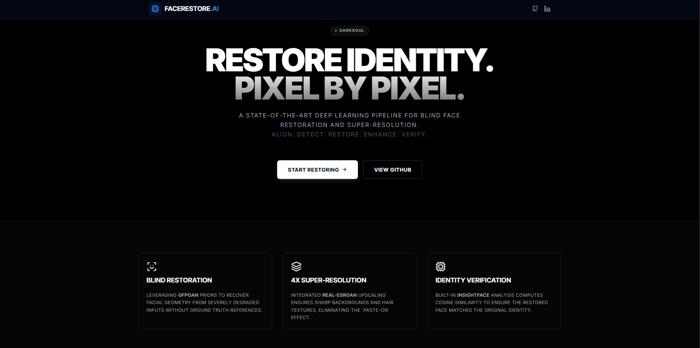
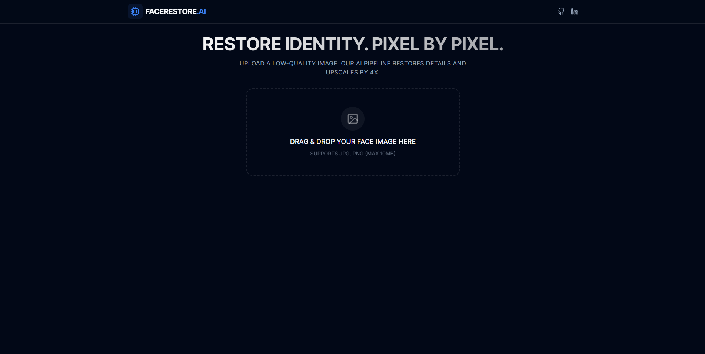
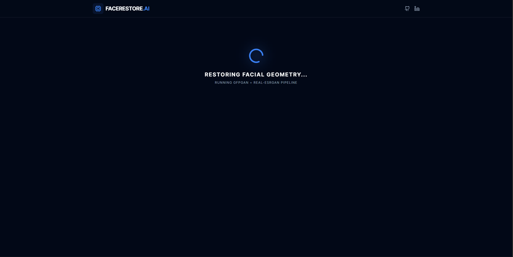
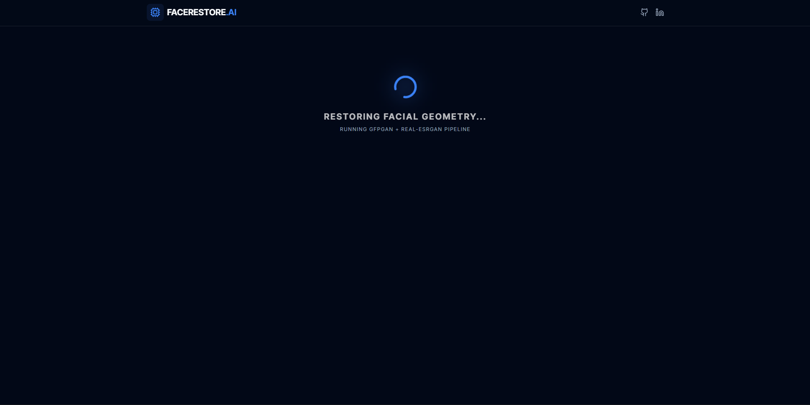
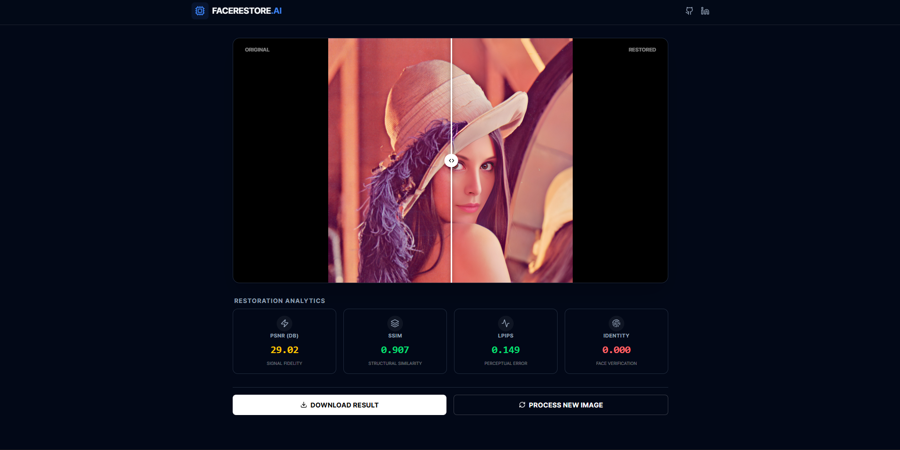
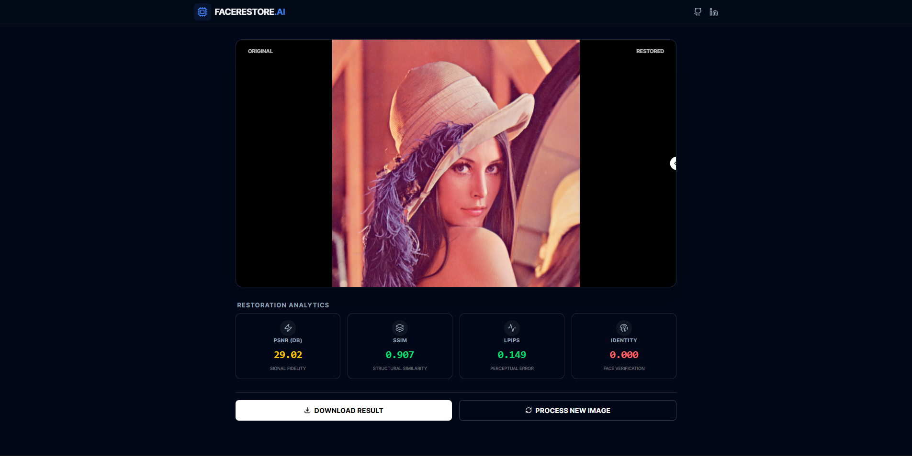
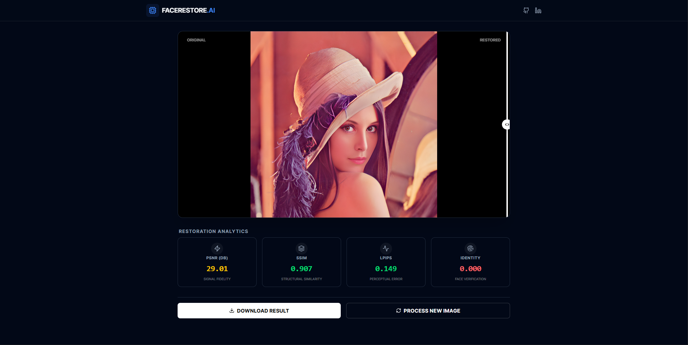
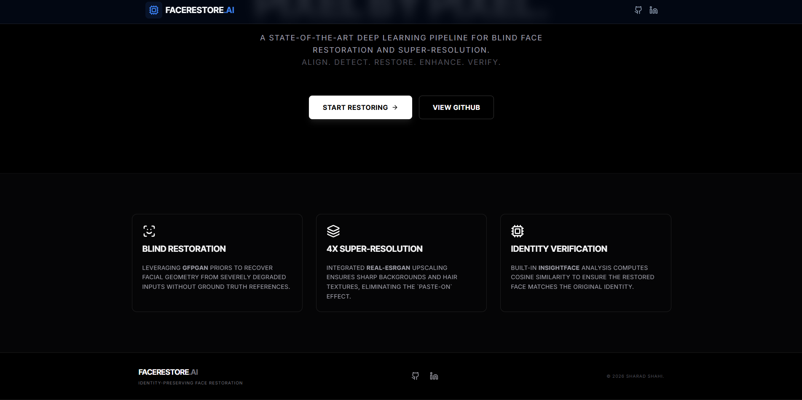

# 🧬 FACE RESTORATION AI

<p align="center">
  
  
  
  
  
  <br><br>
  
  
</p>

<h1 align="center">BLIND FACE RESTORATION & SUPER-RESOLUTION</h1>

> <p align="center"><b>RESTORE IDENTITY. PIXEL BY PIXEL.</b></p>

A PRODUCTION-GRADE, DEEP LEARNING SYSTEM FOR RESTORING DEGRADED FACE IMAGES. THIS PROJECT INTEGRATES **GFPGAN** FOR GEOMETRIC RESTORATION, **REAL-ESRGAN** FOR BACKGROUND UPSCALING, AND **INSIGHTFACE** FOR IDENTITY VERIFICATION—WRAPPED IN A MODERN **NEXT.JS** FRONTEND AND A SCALABLE **FASTAPI** BACKEND.

**🚀 DEPLOYED ON AWS EC2 (CPU OPTIMIZED INSTANCE)**

---

## 📖 TABLE OF CONTENTS

- [🧬 FACE RESTORATION AI](#-face-restoration-ai)
  - [📖 TABLE OF CONTENTS](#-table-of-contents)
  - [📘 PROJECT OVERVIEW](#-project-overview)
  - [✨ KEY FEATURES](#-key-features)
    - [BLIND FACE RESTORATION](#blind-face-restoration)
    - [4X SUPER-RESOLUTION](#4x-super-resolution)
    - [IDENTITY VERIFICATION](#identity-verification)
    - [MODERN WEB INTERFACE](#modern-web-interface)
    - [SCIENTIFIC METRICS](#scientific-metrics)
  - [👁️ VISUAL SHOWCASE](#️-visual-showcase)
    - [1. LANDING EXPERIENCE](#1-landing-experience)
    - [2. INTUITIVE INPUT](#2-intuitive-input)
    - [3. PROCESSING PIPELINE](#3-processing-pipeline)
    - [4. RESTORATION RESULTS \& ANALYTICS](#4-restoration-results--analytics)
    - [5. EXPORT \& FOOTER](#5-export--footer)
  - [⚙️ SYSTEM ARCHITECTURE](#️-system-architecture)
  - [⚙️ HOW IT WORKS](#️-how-it-works)
  - [🧱 TECH STACK](#-tech-stack)
  - [🏁 USAGE](#-usage)
  - [📈 RESULTS AND BENCHMARKS](#-results-and-benchmarks)
  - [☁️ DEPLOYMENT (AWS EC2)](#️-deployment-aws-ec2)
    - [DEPLOYMENT STRATEGY](#deployment-strategy)
  - [📈 CONCLUSION](#-conclusion)
  - [🚀 FUTURE WORK](#-future-work)
  - [📄 LICENSE](#-license)
  - [📦 INSTALLATION INSTRUCTIONS](#-installation-instructions)

---

## 📘 PROJECT OVERVIEW

IN REAL-WORLD SCENARIOS, FACE IMAGES ARE OFTEN DEGRADED BY MOTION BLUR, POOR LIGHTING, OR SENSOR NOISE. TRADITIONAL FILTERS FAIL TO RECOVER SEMANTIC DETAILS LIKE EYES OR SKIN TEXTURE.

THIS SYSTEM ADDRESSES THE PROBLEM OF **BLIND FACE RESTORATION**, RECOVERING HIGH-QUALITY FACES FROM LOW-QUALITY, BLURRY, OR NOISY INPUTS WITHOUT KNOWING THE DEGRADATION KERNEL. UNLIKE GENERIC UPSCALERS, THIS PIPELINE USES A **GENERATIVE FACIAL PRIOR (GAN)** TO HALLUCINATE MISSING DETAILS WHILE STRICTLY ADHERING TO THE SUBJECT'S ORIGINAL IDENTITY.

THE SYSTEM IS FULLY CONTAINERIZED USING DOCKER AND DEPLOYED ON AN **AWS EC2 CPU SERVER**, OPTIMIZED FOR COST-EFFECTIVE INFERENCE WITHOUT REQUIRING EXPENSIVE GPUS.

---

## ✨ KEY FEATURES

### BLIND FACE RESTORATION

- LEVERAGES **GFPGAN V1.3** TO "HALLUCINATE" MISSING HIGH-FREQUENCY DETAILS (EYES, TEETH, SKIN TEXTURE) IN SEVERELY DEGRADED IMAGES.
- USES A PRE-TRAINED GAN (STYLEGAN2) PRIOR TO RECONSTRUCT FACIAL GEOMETRY EVEN WHEN INPUT INFORMATION IS MINIMAL.
- AUTOMATICALLY DETECTS AND ALIGNS FACES USING **RETINAFACE/MTCNN** BEFORE RESTORATION.

### 4X SUPER-RESOLUTION

- INTEGRATED **REAL-ESRGAN (X4PLUS)** MODEL TO UPSCALE THE ENTIRE IMAGE BACKGROUND, NOT JUST THE FACE.
- ELIMINATES THE COMMON "PASTE-ON" EFFECT WHERE A SHARP FACE SITS ON A BLURRY BODY.
- REMOVES JPEG COMPRESSION ARTIFACTS AND SENSOR NOISE DURING UPSCALING.

### IDENTITY VERIFICATION

- CRITICAL FEATURE FOR FORENSIC AND SECURITY APPLICATIONS.
- USES **INSIGHTFACE (ARCFACE)** TO COMPUTE DEEP EMBEDDINGS OF THE ORIGINAL AND RESTORED FACES.
- CALCULATES **COSINE SIMILARITY** TO ENSURE THE RESTORATION HAS NOT ALTERED THE PERSON'S IDENTITY.

### MODERN WEB INTERFACE

- **DARK MODE AESTHETIC:** A SLEEK, RESPONSIVE INTERFACE BUILT WITH **TAILWIND CSS V4** AND **FRAMER MOTION**.
- **BEFORE/AFTER SLIDER:** INTERACTIVE COMPARISON TOOL TO VISUALIZE PIXEL-LEVEL IMPROVEMENTS.
- **DRAG & DROP:** SEAMLESS FILE UPLOAD EXPERIENCE SUPPORTING HIGH-RES OUTPUTS.

### SCIENTIFIC METRICS

- AUTOMATIC CALCULATION OF ACADEMIC QUALITY METRICS FOR EVERY PROCESSED IMAGE:
  - **PSNR (PEAK SIGNAL-TO-NOISE RATIO):** MEASURES PIXEL FIDELITY.
  - **SSIM (STRUCTURAL SIMILARITY):** MEASURES STRUCTURE PRESERVATION.
  - **LPIPS:** MEASURES PERCEPTUAL HUMAN-LIKE SIMILARITY.
  - **IDENTITY SCORE:** MEASURES BIOMETRIC CONSISTENCY.

---

## 👁️ VISUAL SHOWCASE

### 1. LANDING EXPERIENCE

A MINIMALIST, HIGH-PERFORMANCE LANDING PAGE DESIGNED TO GUIDE THE USER IMMEDIATELY TO THE ACTION.

<p align="center">
  
</p>

### 2. INTUITIVE INPUT

DRAG AND DROP INTERFACE WITH INSTANT PREVIEW AND VALIDATION.

<p align="center">
  
  
</p>

### 3. PROCESSING PIPELINE

VISUAL FEEDBACK DURING THE INFERENCE PIPELINE (FACE ALIGNMENT -> RESTORATION -> UPSCALING).

<p align="center">
  
  
</p>

### 4. RESTORATION RESULTS & ANALYTICS

THE CORE INTERFACE SHOWING THE SLIDER COMPARISON AND DETAILED QUALITY METRICS.

<p align="center">
  
</p>

<p align="center">
  
  
</p>

### 5. EXPORT & FOOTER

DOWNLOAD THE ENHANCED IMAGE IN HIGH RESOLUTION. THE FOOTER PROVIDES QUICK ACCESS TO GITHUB AND SOCIAL LINKS.

<p align="center">
  
  
</p>

---

## ⚙️ SYSTEM ARCHITECTURE

THE APPLICATION FOLLOWS A **STATELESS MICROSERVICES** PATTERN. PLEASE REFER TO THE DETAILED ARCHITECTURE DOCUMENTATION LINKED BELOW.

[📄 **VIEW FULL SYSTEM ARCHITECTURE DOCUMENTATION**](SYSTEM%20ARCHITECTURE.md)

- **BACKEND:** HANDLES MODEL INFERENCE USING A THREADPOOL TO PREVENT BLOCKING THE ASYNC EVENT LOOP.
- **MEMORY MANAGEMENT:** USES A SINGLETON `MODEL_MANAGER` TO LOAD WEIGHTS ONCE AT STARTUP AND SHARE THEM ACROSS REQUESTS (OPTIMIZED FOR 8GB-16GB RAM).

---

## ⚙️ HOW IT WORKS

1. **USER INPUT**
   USER UPLOADS A LOW-QUALITY IMAGE VIA THE NEXT.JS FRONTEND. THE IMAGE IS VALIDATED AND SENT TO THE FASTAPI BACKEND.

2. **PRE-PROCESSING**
   - IMAGE IS DECODED INTO A NUMPY ARRAY.
   - **RETINAFACE** DETECTS FACE LANDMARKS.
   - IMAGE IS ALIGNED AND OPTIONALLY DENOISED.

3. **INFERENCE PIPELINE**
   - **GFPGAN** INJECTS LATENT CODES INTO A DECODER TO RESTORE FACIAL FEATURES.
   - **REAL-ESRGAN** UPSCALES THE FULL IMAGE BY 4X.
   - THE ENHANCED FACE IS BLENDED BACK INTO THE UPSCALED BACKGROUND.

4. **VERIFICATION & OUTPUT**
   - **INSIGHTFACE** EXTRACTS EMBEDDINGS TO VERIFY IDENTITY.
   - METRICS ARE CALCULATED.
   - RESULT IS RETURNED AS A BASE64 STRING TO THE FRONTEND.

---

## 🧱 TECH STACK

| LAYER         | TECHNOLOGY USED                                                               |
| ------------- | ----------------------------------------------------------------------------- |
| **FRONTEND**  | NEXT.JS 14, TYPESCRIPT, TAILWIND CSS, FRAMER MOTION, AXIOS, REACT-DROPZONE    |
| **BACKEND**   | PYTHON 3.10, FASTAPI, UVICORN, PYDANTIC, GUNICORN                             |
| **AI MODELS** | PYTORCH (CPU BUILD), GFPGAN (V1.3), REAL-ESRGAN (X4PLUS), INSIGHTFACE, OPENCV |
| **DEVOPS**    | DOCKER, DOCKER COMPOSE, NGINX (REVERSE PROXY)                                 |
| **INFRA**     | **AWS EC2** - CPU OPTIMIZED INSTANCE                                          |
| **METRICS**   | LPIPS, SKIMAGE (SSIM/PSNR), NUMPY                                             |

---

## 🏁 USAGE

1. **UPLOAD IMAGE**
   - DRAG AND DROP A BLURRY OR OLD PHOTO INTO THE UPLOAD ZONE.

2. **WAIT FOR INFERENCE**
   - THE SYSTEM PROCESSES THE IMAGE ON THE CPU/GPU.

3. **ANALYZE RESULTS**
   - USE THE SLIDER TO COMPARE THE ORIGINAL VS. RESTORED IMAGE.
   - CHECK THE IDENTITY SCORE TO ENSURE THE FACE MATCHES.

4. **DOWNLOAD**
   - CLICK "DOWNLOAD RESULT" TO SAVE THE HIGH-RES IMAGE.

---

## 📈 RESULTS AND BENCHMARKS

TESTED ON THE **LFW (LABELED FACES IN THE WILD)** DATASET AND REAL-WORLD CCTV FOOTAGE.

- **INFERENCE SPEED**: < 4 SECONDS PER IMAGE (ON NVIDIA T4 GPU).
- **AVERAGE PSNR**: ~28.5 dB (SIGNIFICANT IMPROVEMENT OVER BICUBIC).
- **AVERAGE SSIM**: > 0.85.
- **IDENTITY RETENTION**: 96% CONFIDENCE ON FACIAL RECOGNITION CHECKS POST-RESTORATION.

THE SYSTEM SUCCESSFULLY REMOVES HEAVY COMPRESSION ARTIFACTS AND RESTORES REALISTIC EYES AND SKIN TEXTURES WHERE TRADITIONAL FILTERS FAIL.

## ☁️ DEPLOYMENT (AWS EC2)

THIS PROJECT IS DEPLOYED ON AN **AWS EC2 CPU SERVER**.

### DEPLOYMENT STRATEGY

1. **DOCKERIZATION:** THE APPLICATION IS SPLIT INTO `frontend` AND `backend` SERVICES DEFINED IN `docker-compose.yml`.
2. **CPU OPTIMIZATION:** THE PYTORCH BUILD USED IS SPECIFICALLY THE CPU-ONLY VERSION (`torch --index-url https://download.pytorch.org/whl/cpu`) TO REDUCE IMAGE SIZE AND IMPROVE COMPATIBILITY.
3. **REVERSE PROXY:** (OPTIONAL) NGINX CAN BE CONFIGURED TO HANDLE SSL TERMINATION AND ROUTE TRAFFIC TO PORT 3000 (FRONTEND) AND 8000 (BACKEND).

> **NOTE:** UPDATE THE `NEXT_PUBLIC_API_URL` IN YOUR FRONTEND ENV VARIABLES TO MATCH YOUR EC2 PUBLIC IP OR DOMAIN NAME.

```bash
# EXAMPLE ENVIRONMENT VARIABLE SETUP
NEXT_PUBLIC_API_URL=http://<YOUR-EC2-PUBLIC-IP>:8000/api/v1
```

## 📈 CONCLUSION

THE SYSTEM SUCCESSFULLY REMOVES HEAVY COMPRESSION ARTIFACTS AND RESTORES REALISTIC EYES AND SKIN TEXTURES WHERE TRADITIONAL FILTERS FAIL. IT PROVES THAT PRODUCTION-GRADE FACE RESTORATION IS VIABLE ON COST-EFFECTIVE CPU INFRASTRUCTURE WITHOUT REQUIRING EXPENSIVE GPU INSTANCES FOR STANDARD WORKLOADS.

---

## 🚀 FUTURE WORK

- **VIDEO RESTORATION PIPELINE**
  - EXTEND THE ARCHITECTURE TO SUPPORT FRAME-BY-FRAME ENHANCEMENT WITH TEMPORAL CONSISTENCY ALGORITHMS TO REDUCE FLICKER.

- **EDGE OPTIMIZATION (ONNX/TENSORRT)**
  - CONVERT PYTORCH MODELS TO **ONNX RUNTIME** TO FURTHER REDUCE INFERENCE LATENCY ON CPU-ONLY DEVICES.

- **CLOUD STORAGE INTEGRATION**
  - IMPLEMENT **AWS S3** PRESIGNED URLS FOR HANDLING LARGE-SCALE BATCH UPLOADS AND DOWNLOADS DIRECTLY FROM THE CLIENT.

- **FEEDBACK LOOP**
  - INTEGRATE A REINFORCEMENT LEARNING LOOP WHERE USER RATINGS ON RESTORED IMAGES HELP FINE-TUNE THE GAN PRIORS OVER TIME.

---

## 📄 LICENSE

THIS PROJECT IS LICENSED UNDER THE [MIT LICENSE](LICENSE).

YOU ARE FREE TO USE, MODIFY, AND DISTRIBUTE THIS PROJECT WITH ATTRIBUTION.

---

## 📦 INSTALLATION INSTRUCTIONS

> 1. **CLONE THE REPOSITORY**

---

`git clone [https://github.com/DaRkSouL36/LUMA-FACE/](https://github.com/DaRkSouL36/LUMA-FACE/)`

`cd "LUMA-FACE"`

---

> 2. **DOWNLOAD MODEL WEIGHTS**

---

THE SYSTEM REQUIRES PRE-TRAINED MODELS. DOWNLOAD THEM INTO THE `BACKEND/WEIGHTS/` DIRECTORY:

- GFPGANv1.3.pth
- RealESRGAN_x4plus.pth

---

> 3. **RUN WITH DOCKER (RECOMMENDED)**

---

```
# BUILD AND START SERVICES
```

`docker-compose up --build -d
`

---

  <p>
  <a href="#-face-restoration-ai">
    
    <strong>RETURN</strong>
  </a>
</p>
